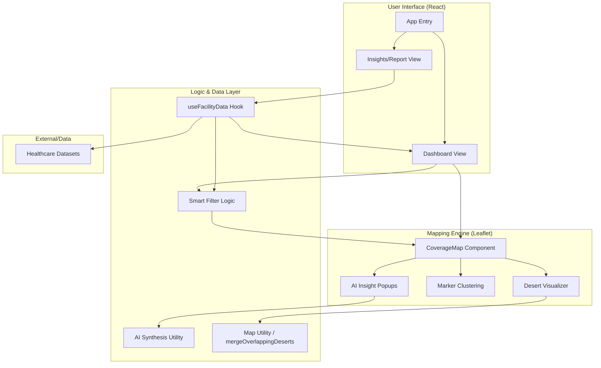

# 🛠️ Tech Stack & Architecture

## 💻 Technology Stack

### Core Frontend
- **React 18**: Component-based UI logic and state management.
- **Vite**: High-performance build tool and dev server.
- **TypeScript**: Type-safe development for complex healthcare data structures.

### Mapping & Geodata
- **Leaflet.js**: Core engine for interactive map rendering.
- **Leaflet MarkerCluster**: Efficiently handling thousands of facility markers.
- **GeoJSON & Custom Logic**: Specialized medical desert geometry calculations.

### Design & Motion
- **Tailwind CSS**: Utility-first CSS for a custom "Glassmorphism" design system.
- **Framer Motion**: Smooth entry/exit animations, collapsible panels, and pulsing effects.
- **Lucide React**: Vector icons for clear, modern visual communication.

### Intelligence Layer
- **AI-Powered Insights**: Custom logic for calculating network centrality and quality-based strategic recommendations.
- **Data Hooks**: Custom `useFacilityData` hook for structured data ingestion and filtering.

---

## 🏗️ System Architecture

### Data Flow Overview
1. **Ingestion**: Raw healthcare CSV data is loaded via the `useFacilityData` hook.
2. **Processing**: `mergeOverlappingDeserts` calculates gaps based on WHO proximity standards and population density.
3. **Filtering**: The `Smart Filter` state propagates changes to the `CoverageMap` for real-time layer updates.
4. **Synthesis**: When a user interacts with a facility, the `AI Synthesis` utility generates context-aware insights (Network Score, Quality Assessment) for the popup display.
5. **Reporting**: Aggregated stats (Population at Risk, Region Counts) are derived from the same source of truth for the final vulnerability report.
